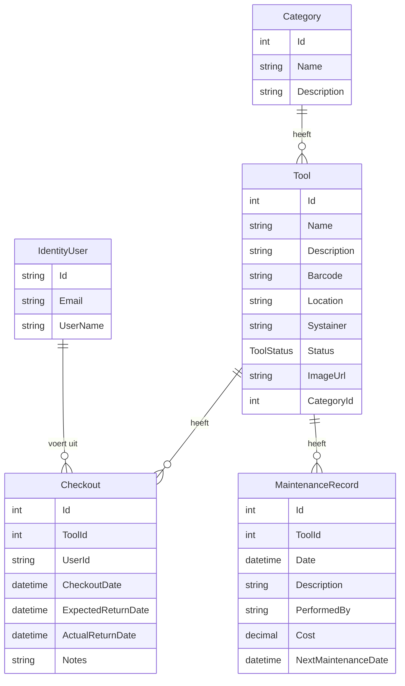
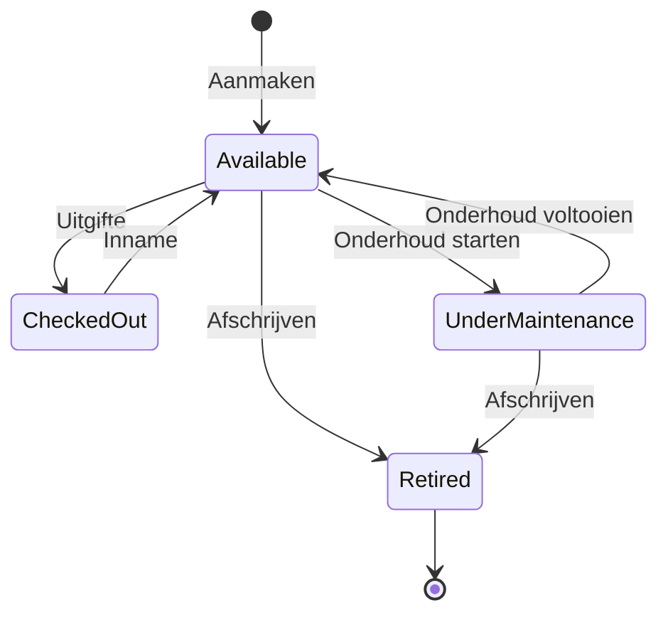

# Architectuurdocumentatie – ToolInventory

## 1. Overzicht

ToolInventory is een full-stack applicatie voor het beheren van gereedschapsinventarissen. Het systeem bestaat uit drie lagen:

| Laag | Technologie | Locatie |
|---|---|---|
| Backend API | .NET 10, ASP.NET Core, EF Core, ASP.NET Identity, JWT | `src/` |
| Webfrontend | Angular 21, Angular Material | `frontend/tool-inventory-app/` |
| Mobiele app | .NET MAUI (.NET 10) | `mobile/ToolInventory.MAUI/` |
| Testen | xUnit, Playwright (E2E) | `tests/` |

---

## 2. Backend-architectuur

### 2.1 Projectstructuur

```
src/
├── ToolInventory.API           # ASP.NET Core Web API (entry point)
│   ├── Controllers/            # Dunne controllers – delegeren naar services
│   ├── Services/               # Business-logica (Tool, Checkout, Maintenance)
│   ├── Extensions/             # ServiceCollectionExtensions, ApplicationBuilderExtensions
│   ├── Middleware/             # Middleware (bijv. exception handling)
│   ├── Common/                 # InputNormalizer, ControllerBaseExtensions
│   └── Program.cs              # Minimal startup
├── ToolInventory.Core          # Domeinmodel (entiteiten, interfaces)
│   ├── Entities/               # Tool, Category, Checkout, MaintenanceRecord, User, ToolStatus
│   └── Interfaces/             # IRepository<T>, IUnitOfWork
├── ToolInventory.Infrastructure # Data-toegang
│   └── Data/                   # AppDbContext, Repository<T>, UnitOfWork, Migrations
└── ToolInventory.Shared        # Gedeelde DTOs (API ↔ clients)
    └── DTOs/                   # AuthDto, ToolDto, CheckoutDto, MaintenanceRecordDto, CategoryDto
```

### 2.2 Lagenmodel

```
┌──────────────────────────────────────┐
│           Controllers (API)          │  ← HTTP in/out, validatie, routering
├──────────────────────────────────────┤
│       Service Layer (API)            │  ← Business-regels, status-overgangen
├──────────────────────────────────────┤
│   IUnitOfWork / IRepository (Core)   │  ← Abstractie van data-toegang
├──────────────────────────────────────┤
│   AppDbContext / EF Core (Infra)     │  ← SQL Server, migraties
└──────────────────────────────────────┘
```

### 2.3 Domeinentiteiten en relaties



### 2.4 Tool-statusmachine



### 2.5 Beveiliging

- **Authenticatie**: JWT Bearer tokens (HMAC-SHA256)
- **Autorisatie**: Alle endpoints (behalve `/api/auth`) vereisen een geldig JWT-token
- **Rate limiting**: Fixed-window 120 verzoeken/minuut per IP-adres; wachtrij van 10
- **CORS**: Alleen geconfigureerde origins (`Cors:AllowedOrigins`)
- **Wachtwoordbeleid**: min. 8 tekens, hoofdletter, cijfer, speciaal teken (via ASP.NET Identity)

### 2.6 Patroon: Repository + Unit of Work

- `IRepository<T>` biedt generieke CRUD + gepagineerde query's met includes en predicaten.
- `IUnitOfWork` bundelt alle repositories en exposeert `SaveChangesAsync`.
- Alle schrijfoperaties verloopen via `uow.SaveChangesAsync` zodat atomaire transacties gewaarborgd zijn.

---

## 3. Frontend-architectuur (Angular)

```
frontend/tool-inventory-app/src/app/
├── features/       # Domein-features (tools, checkouts, maintenance, scanner, auth)
├── guards/         # Route-guards (authenticatie)
├── interceptors/   # HTTP-interceptors (JWT-token toevoegen)
├── models/         # TypeScript-interfaces / DTOs
├── services/       # Angular-services (API-aanroepen)
└── shared/         # Gedeelde componenten (confirm-dialog, status-kleurkaart, …)
```

- **Routing**: Angular Router met lazy-loaded feature modules.
- **UI**: Angular Material components.
- **Auth**: JWT opgeslagen in localStorage; interceptor voegt `Authorization: Bearer …` toe.
- **Confirm-dialoog**: Gecentraliseerd Angular Material dialog vervangt `window.confirm()`.

---

## 4. Mobiele architectuur (.NET MAUI)

```
mobile/ToolInventory.MAUI/
├── ViewModels/     # MVVM ViewModels (Tools, Checkout, Maintenance, Scanner, Login)
├── Views/          # XAML-pagina's
├── Services/       # ToolApiService, AuthService, UserDialogService
├── Navigation/     # AppRoutes.cs (centrale route-constanten)
└── Converters/     # XAML value converters
```

- **Patroon**: MVVM via `CommunityToolkit.Mvvm`.
- **API-resultaten**: `ApiResult<T>` wrapper met status en foutdetails.
- **Dialogen**: `IUserDialogService` abstractie voor platform-onafhankelijke dialogen.
- **Scanner**: Barcode-scan → `PUT /api/checkouts/tool/{toolId}/checkin` (geen volledige lijstquery).

---

## 5. CI/CD en beveiliging

- **CodeQL**: statische code-analyse bij elke PR.
- **Gitleaks**: geheimen-scan.
- **Dependency Review**: controle op kwetsbaarheden in afhankelijkheden.
- **SBOM**: Software Bill of Materials wordt gegenereerd bij elke build.
- **Dependabot**: automatische updates voor GitHub Actions.

---

## 6. Containerisatie

Zowel de API (`src/ToolInventory.API/Dockerfile`) als de webfrontend (`frontend/tool-inventory-app/Dockerfile`) hebben een Docker-configuratie met een Nginx-reverse proxy voor de Angular SPA.
